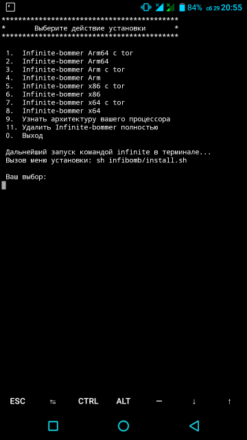

# Installing

<b>Download<b> <a href="https://play.google.com/store/apps/details?id=com.termux&hl=ru">Termux from Google Play</a>, and write command in terminal: 
 
• <code>apt update</code> 
• <code>apt upgrade</code> 
• <code>apt install git</code> 
• <code>git clone https://github.com//intelpol/infibomb</code> 
• <code>sh infibomb/install.sh</code> 

